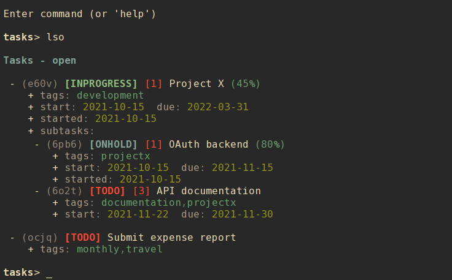

# nrrdtask

A terminal-based task management program with advanced search options, formatted output, and task data stored in local text files.

    > nrrdtask query tags=development+testing%status=done --limit status,priority,percent,description
    inprogress  1   Unit tests for projectX     25
    todo    4   Documentation update for projectY
    todo    5   Go through resumes for jr dev role
    inprogress  2   Code review on new projectZ data writer module  95

## Contents

- [Getting nrrdtask](#getting-nrrdtask)
    - [Downloading](#downloading)
    - [Python dependencies](#python-dependencies)
    - [Installing](#installing)
        - [Setuptools](#setuptools)
        - [Make](#make)
- [Using nrrdtask](#using-nrrdtask)
    - [Basic usage](#basic-usage)
    - [Command-line usage](#command-line-usage)
        - [Listing tasks](#listing-tasks)
        - [Viewing a task](#viewing-a-task)
        - [Creating a new task](#creating-a-new-task)
        - [Assigning a task to a project](#assigning-a-task-to-a-project)
        - [Modifying a task](#modifying-a-task)
        - [Clearing values from a task](#clearing-values-from-a-task)
        - [Adding and editing notes](#adding-and-editing-notes)
        - [Deleting a task](#deleting-a-task)
        - [Editing a task](#editing-a-task)
        - [Archiving a task](#archiving-a-task)
        - [Task recurrence](#task-recurrence)
            - [How repeating tasks work](#how-repeating-tasks-work)
        - [Search and query](#search-and-query)
        - [Exclusion](#exclusion)
        - [Search examples](#search-examples)
        - [Query and limit](#query-and-limit)
        - [Paging](#paging)
        - [Exporting to iCal](#exporting-to-ical)
        - [Importing from iCal](#importing-from-ical)
        - [Other commands](#other-commands)
    - [Interactive shell](#interactive-shell)
        - [Interactive modify](#interactive-modify)
        - [A note about refresh](#a-note-about-refresh)
    - [Configuration](#configuration)
        - [Default configuration](#default-configuration)
        - [Alternate configuration](#alternate-configuration)
        - [Editing configuration](#editing-configuration)
        - [Main configuration options](#main-configuration-options)
        - [Color configuration options](#color-configuration-options)
    - [Task data](#task-data)
        - [Task data fields](#task-data-fields)
            - [Managed fields](#managed-fields)
            - [User-modified fields](#user-modified-fields)

## Getting `nrrdtask`
### Downloading
To download `nrrdtask` simply clone this repository:

    git clone https://github.com/sdoconnell/nrrdtask.git

### Python dependencies
`nrrdtask` requires Python 3.8+ and the following Python 3 libraries to be available:

- `tzlocal`
- `dateutil`
- `pyyaml`
- `rich`
- `watchdog`

You may install these dependencies from your Linux distribution's repos (if available) or via `pip` using the `requirements.txt` file provided in this repository:

    pip install -r requirements.txt

### Installing
You may install the application one of two ways: via `setuptools`, or via `make`. Installing via `make` will also install the manpage for `nrrdtask(1)` and will copy the `README.md` file into your system documentation directory.

#### Setuptools
Run the `setup.py` script to install system-wide (likely requires `su` or `sudo`):

    sudo python3 setup.py install

Alternatively, you may install the package to your `$HOME` directory.

    python3 setup.py install --user

#### Make
Use `make` to install the application system-wide (likely requires `su` or `sudo`):

    sudo make install

There is also an `uninstall` operation available:

    sudo make uninstall

## Using `nrrdtask`
### Basic usage
`nrrdtask` is a terminal-based application that can be run in either of two modes: command-line or interactive shell.

    nrrdtask -h
    usage: nrrdtask [-h] [-c <file>] for more help: nrrdtask <command> -h ...

    Terminal-based task management for nerds.

    commands:
      (for more help: nrrdtask <command> -h)
        archive             archive a task
        complete            complete a task
        delete (rm)         delete a task file
        edit                edit a task file (uses $EDITOR)
        export              export tasks to iCalendar-formatted VTODO output
        info                show info about a task
        list (ls)           list tasks
        modify (mod)        modify a task
        new                 create a new task
        notes               add/update notes on a task (uses $EDITOR)
        query               search tasks with structured text output
        reminders (rem)     task reminders
        search              search tasks
        shell               interactive shell
        start               start a task
        unset               clear a field from a specified task
        version             show version info

    optional arguments:
      -h, --help            show this help message and exit
      -c <file>, --config <file>
                            config file

### Command-line usage
#### Listing tasks
There are eight options for listing your tasks:

1. `list all` (or `lsa`) : list all tasks.
2. `list open` (or `lso`) : list all tasks without a status of `done`.
3. `list done` (or `lsd`) : list all tasks with a status of `done`.
4. `list nosubs` (or `lsn`) : list all tasks that are not subtasks (tasks with a `parent`).
5. `list soon` (or `lss`) : list all tasks with a `start` or `due` date that is "soon" (as defined by `days_soon` in the config file).
6. `list late` (or `lsl`) : list all tasks with a `start` or `due` date in the past, if the task's status is `todo`.
7. `list today` (or `lst`) : list all tasks with a `start` or `due` date of today's date.
8. `list <alias>` : list a specific task and all subtasks (if any).

Entries are listed in the following tabular format:

        - (alias) [STATUS] [priority] description (percent%)
          + location: location
          + tags: tags
          + start: YYYY-MM-DD [MM:SS]  due: YYYY-MM-DD [MM:SS]
          + started: YYYY-MM-DD [MM:SS]  completed: YYYY-MM-DD [MM:SS]
          + parent: parent

- **Line 1**: the task alias, status, priority, description and percent complete.
- **Line 2**: the task location (if set).
- **Line 3**: the tags assigned to the task (if set).
- **Line 4**: the start and due dates of the task (if set).
- **Line 5**: the started and completed dates of the task (if set).
- **Line 6**: the task's parent (if a subtask, only shown in certain views where the parent is not obvious).

When using `list` you may filter the tasks listed to a specific project by using the `--project` option.

    nrrdtask list all --project jones_electric

#### Viewing a task
You may view all available details about a task by using the `info` command and supplying the task's `alias`. For example:

    nrrdtask info 5kzb

#### Creating a new task
Use the `new` subcommand to create a new task. This option will create a new entry file in your `nrrdtask` data directory (`$XDG_DATA_HOME/nrrdtask` or `$HOME/.local/share/nrrdtask` by default). See `nrrdtask new -h` for all available options and their command syntax.

    nrrdtask new [options]

#### Assigning a task to a project
When creating a task with `new` or using `modify` to update a task, you may set the project for the task with the `--project` option.

    nrrdtask modify 3er5 --project jones_electric

**NOTE**: project names are case-insensitive and are presented in lowercase. You should not use spaces in project names.

#### Modifying a task
Task data may be changed using the `modify` command. See `nrrdtask modify -h` for all available options and their command syntax.

    nrrdtask modify <alias> [options]

#### Clearing values from a task
The following fields of a task can be cleared (set to `null`) using the `unset` command:
- `tags`
- `start`
- `due`
- `started`
- `completed`
- `priority`
- `percent`
- `parent`
- `project`

The command syntax is:

    nrrdtask unset <alias> <field>

#### Adding and editing notes
To add or edit notes attached to a task, use the `notes` command:

    nrrdtask notes <alias>

Notes for the task will be opened in the user's preferred editor (defined by `$EDITOR`). When the editor exits, the updated notes will be written to the task file. This is the safest mode of adding notes to a task file, as `nrrdtask` will handle the necessary quoting/escaping to ensure proper YAML is written to the file.

#### Deleting a task
Use the `delete` subcommand to delete a task identified by the record's `alias`. Confirmation will be required for this operation unless the `--force` option is also used.

    nrrdtask delete <alias> [--force]

If you delete a task that has subtasks, the subtasks will also be deleted.

#### Editing a task
Use the `edit` subcommand to open the task file in your preferred editor. Use care in editing the task file directly. Malformed file structure may result in `nrrdtask` being unable to properly parse the file.

#### Archiving a task
Use the `archive` subcommand to move the task file to the subdirectory `archive` in the the tasks data directory. Confirmation will be required for this operation unless the `--force` option is also used.

Archived tasks will no longer appear in lists of tasks (done or otherwise). This can be useful for retaining completed tasks without resulting in endlessly growing task lists. To review archived tasks, create an alterate config file with a `data_dir` pointing to the archive folder, and an alias such as:

    alias nrrdtask-archive="nrrdtask -c $HOME/.config/nrrdtask/config.archive"

If you archive a task that has subtasks, the subtasks will also be archived.

#### Task recurrence
Tasks may have a recurrence rule (using the `--rrule` option to `new` and `modify`) to express that the task repeats or occurs more than once. The `rrule` is a semicolon-delimited list of key/value pairs.

The supported keys are:

    - date= : (str) specific recurrence date/times, delimited by comma (,).
    - except= : (str) specific date/times to be excluded, delimited by comma (,).
    - freq= : (str) one of minutely, hourly, daily, weekly, monthly, or yearly.
    - count= : (int) a specific number of recurrences.
    - until= : (str) recur until this date/time.
    - interval= : (int) the interval of recurrence.
    - byhour= : (int) recur by hour (0-23).
    - byweekday= : (str) one or more (comma-delimited) of SU, MO, TU, WE, TH, FR, or SA.
    - bymonth= : (int) recur by month (1-12).
    - bymonthday= : (int) recur by day of month (1-31).
    - byyearday= : (int) recur by day of the year (1-366).
    - byweekno= : (int) recur by week of year (1-53).
    - bysetpos= : (int) the position in an occurence set (e.g., 1 for first, -1 for last, -2 for second to last).

For example, a task that recurs on the last Monday of the month until December 31, 2021 would have the following rrule:

    freq=monthly;byweekday=MO;bysetpos=-1;until=2021-12-31

**NOTE:** ensure to properly escape or quote ';' in recurrence rules when using the --rrule option on the command line.

A task MUST have both a `start` date/time and an `rrule` to be considered a recurring task. A task with an `rrule` and no `start` will be treated as a regular task.

##### How repeating tasks work
Only one active (non-'done') instance of a repeating task will appear in the task list at any given time. When the `status` of a repeating task is set to 'done' or 'cancelled', `nrrdtask` will clone the task into a new task with a `status` of 'todo', and `start` and `due` set to the next occurrence date and relative due date (if any). Other progress fields (e.g., `started`, `completed`, `percent`, etc.) will be reset. Completed recurring tasks remain in history and exist in the `data_dir` like any other task.

#### Search and query
There are two command-line methods for filtering the presented list of tasks: `search` and `query`. These two similar-sounding functions perform very different roles.

Search results are output in the same tabular, human-readable format as that of `list`. Query results are presented in the form of tab-delimited text (by default) or JSON (if using the `-j` or `--json` option) and are primarily intended for use by other programs that are able to consume structured text output.

Search and query use the same filter syntax. The most basic form of filtering is to simply search for a keyword or string in the task description:

    nrrdtask search <search_term>

**NOTE**: search terms are case-insensitive.

If the search term is present in the task description, the task will be displayed.

Optionally, a search type may be specified. The search type may be one of `uid`, `alias`, `description`, `location`, `tags`, `status`, `parent`, `priority`, `percent`, `start`, `due`, `started`, `completed`, or `notes`. If an invalid search type is provided, the search type will default to `description`. To specify a search type, use the format:

    nrrdtask search [search_type=]<search_term>

You may combine search types in a comma-delimited structure. All search criteria must be met to return a result.

The `tags` search type may also use the optional `+` operator to search for more than one tag. Any matched tag will return a result.

The special search term `any` can be used to match all tasks, but is only useful in combination with an exclusion to match all records except those excluded.

#### Exclusion
In addition to the search term, an exclusion term may be provided. Any match in the exclusion term will negate a match in the search term. An exclusion term is formatted in the same manner as the search term, must follow the search term, and must be denoted using the `%` operator:

    nrrdtask search [search_type=]<search_term>%[exclusion_type=]<exclusion_term>

#### Search examples
Search for any task description with the word "projectx":

    nrrdtask search projectx

Search for any tasks due 2021-11-15:

    nrrdtask search due=2021-11-15

Search for all tasks tagged "development" or "testing" with a status of "inprogess" and a priority of 1-3, except for those that are 95% or more complete:

    nrrdtask search status=inprogress,priority=~3,tags=development+testing%percent=95~

#### Query and limit
The `query` function uses the same syntax as `search` but will output information in a form that may be read by other programs. The standard fields returned by query for tab-delimited output are:

- `uid` (string)
- `alias` (string)
- `status` (string)
- `priority` (string)
- `description` (string)
- `location` (string)
- `project` (string)
- `percent` (string)
- `tags` (list)
- `parent` (string)
- `start` (string)
- `due` (string)
- `started` (string)
- `completed` (string)

List fields are returned in standard Python format: `['item 1', 'item 2', ...]`. Empty lists are returned as `[]`. Empty string fields will appear as multiple tabs.

JSON output returns all fields for a record, including fields not provided in tab-delimited output.

The query function may also use the `--limit` (`-l`) option. This is a comma-separated list of fields to return. The `--limit` option does not have an effect on JSON output.

#### Paging
Output from `list`, `search`, and `info` can get long and run past your terminal buffer. You may use the `-p` or `--page` option in conjunction with `search`, `list`, or `info` to page output.

#### Exporting to iCal
One or more tasks may be exported in iCal VTODO format by using the `export` subcommand and supplying a search term (in the same format as `search` or `query`). At the command line, VTODO output is sent to `stdout` and may be redirected to a file in the usual manner. In interactive shell mode, a filename may be supplied as a second command argument for the output destination.

#### Importing from iCal
There are significant variances between different iCalendar implementations and supported extensions amongst software vendors (both FOSS and proprietary). Importation from VTODO data in a manner that will reliably function while still maintaining the accuracy and integrity of task data is not practical at this time.

As such, **the ability to import from VTODO is not supported and there are no plans at this time to add that feature**.

If you require a command-line task management program that more directly supports VTODO/iCal as a native format, I would suggest you evaluate the [pimutils](https://pimutils.org/) project's [todoman](https://github.com/pimutils/todoman) and see if it will meet your needs.

#### Other commands
The `reminders` command is used to output a list of future task reminders. This command is not intended for use directly, but for other programs to interact with task data from `nrrdtask` (i.e., to produce alerts or emails for task reminders). The command syntax is `reminders <interval>`.

### Interactive shell
`nrrdtask` also features an interactive mode, enabled by `shell`. This mode offers commands similar to the command-line options, but in a persistent shell-like environment.

Most commands are similar to their command-line argument analogs:

- `list <view> [project]` (or `lso`, `lsa`, `lsd`, `lsn`, `lss`, `lsl`, `lst`)
- `config`
- `new`
- `archive <alias>`, confirmation is always required (no `--force`).
- `info <alias>`
- `edit <alias>`
- `modify <alias>`
- `notes <alias>`
- `delete <alias>` (or `rm <alias>`), confirmation is always required (no `--force`).
- `search <term>`
- `start <alias>`
- `complete <alias>`
- `export <term> <file>`
- `help [command]`

**NOTE**: `query` does not have a shell command, as there is no obvious use case for that command in interactive mode.

A couple of additional shell-specific commands exist:
- `clear` : clear the shell output.
- `refresh` : re-read the task files on disk if edits were made outside of `nrrdtask`.

#### Interactive modify
To modify a task in interactive mode, use the command `modify <alias>` to enter a subshell for modifying the record. When done making changes, you may leave the subshell with the command `done`. For available commands, use the `help` command while in the modify subshell. The syntax is similar to that for the CLI modify command, with the exception that it is not necessary to specify an alias with the subcommands (due to the subshell context being a specific task). For example:

CLI usage:

    nrrdtask modify aw4d --tags +development,testing

Interactive usage:

    tasks> modify aw4d
    modify (aw4d)> tags +development,testing
    modify (aw4d)> done
    tasks>

All changes made while in the `modify` subshell take effect (and are saved) immediately.

#### A note about `refresh`
When using `new`, `edit`, or `delete` it is **not** necessary to perform a manual `refresh` afterward. This is done automatically when the previous operation is completed. In general, a manual `refresh` should not be needed but the functionality is included to cover edge cases.
 

### Configuration
#### Default configuration
By default, `nrrdtask` reads its configuration from a config file located at either `$XDG_CONFIG_HOME/nrrdtask/config` or `$HOME/.config/nrrdtask/config`. If the default configuration file does not exist, `nrrdtask` will attempt to create the file with default options specified.

#### Alternate configuration
Instead of the default configuration file, an alternate config file may be selected by using the command-line argument `-c <file>`.

#### Editing configuration
For convenience, the `config` command will open the config file in your `$EDITOR`. In interactive shell mode, the configuration will be reloaded after editing and the new settings applied immediately.

#### Main configuration options
The following options are available under the `[main]` header of the configuration file:

- `data_dir` : (str) the location of task files.
- `days_soon` : (int) number of days in the future that is considered to be "soon" (default: 1).
- `priority_high` : (int) the threshold for high priority color coding (default: 3).
- `priority_medium` : (int) the threshold for medium priority color coding (default: 6).
- `priority_normal` : (int) the threshold for normal priority color coding (default: 9). Any priority value greater than "normal" is considered to be "low" priority.
- `default_duration` : (int) the default time interval (in minutes) for reminder notifications.
- `user_email` : (str) the user's email address (for email notifications of reminders).

#### Color configuration options
`nrrdtask` supports customization of colors and bold in output. The following options are available under the `[colors]` header of the configuration file:

- `disable_colors` : (bool) turn off color output.
- `disable_bold` : (bool) turn off bold font output.
- `color_pager` : (bool) turn on or off color output in the pager (disabled by default, enable if your pager supports color output).

The following options under the `[colors]` header can be used to define a custom color scheme. Specify one of the standard terminal color names such as `red`, `black`, `bright_yellow`, etc.

- `title` : (str) the color for the table title.
- `description` : (str) the color for task description text.
- `location` : (str) the color for task location text.
- `alias` : (str) the color for alias text.
- `tags` : (str) the color for tags text.
- `parent` : (str) the color for parent text.
- `label` : (str) the color for field labels.
- `date` : (str) the default color for dates.
- `date_soon` : (str) the color for dates that are soon.
- `date_late` : (str) the color for dates that are late.
- `status_done` : (str) the color for 'done' status.
- `status_todo` : (str) the color for 'todo' status.
- `status_inprogress` : (str) the color for 'inprogress' status.
- `status_waiting` : (str) the color for 'waiting' status.
- `status_onhold` : (str) the color for 'onhold' status.
- `status_blocked` : (str) the color for 'blocked' status.
- `status_cancelled` : (str) the color for 'cancelled' status.
- `priority_high` : (str) the color for high priority values.
- `priority_medium` : (str) the color for medium priority values.
- `priority_normal` : (str) the color for normal priority values.
- `priority_low` : (str) the color for low priority values.
- `percent` : (str) the default color for percent text.
- `percent_100` : (str) the color for percent when the value is 100.

To use custom colors for specific project names in task lists and info output, you may add entries under the `[project_colors]` header of the config file in the form `<project name> = <color>`.

### Task data
Task files are stored the `data_dir` defined by the `nrrdtask` configuration file. The default location is `$XDG_DATA_HOME/nrrdtask` or `$HOME/.local/share/nrrdtask`. Each task is stored in its own text file and is serialized in [YAML](https://yaml.org/) format. For more information about editing YAML files, see the [YAML spec](https://yaml.org/spec/1.2/spec.html).

#### Task data fields
In theory, any arbitrary data may be stored in task files. However, `nrrdtask` will only parse and display the below data set.

##### Managed fields
The following fields are managed by `nrrdtask` and should not be edited directly.

- `uid` : an [RFC 4122](https://datatracker.ietf.org/doc/html/rfc4122) UUID, randomly generated when the record is created via `new`.
- `created` : Datetime timestamp. Generated when the record is created via `new`.
- `updated` : Datetime timestamp. Generated when the record is created via `new` and updated when the record is edited via `modify`.
- `alias` : A randomly-generated 4-digit alias for the task.

##### User-modified fields
The following fields may be modified by the user.

- `tags` : Tags assigned to the task. (list)
- `description` : The description for the task.
- `location` : The location for the task.
- `priority` : The task priority (int).
- `start` : The task start date/time (datetime).
- `due` : The task due date/time (datetime).
- `started` : The task started date/time (datetime).
- `completed` : The task completed date/time (datetime).
- `percent` : The task percent complete (int).
- `status` : The task status.
- `parent` : The alias of the task's parent (for subtasks).
- `project` : The project to which the task is associated.
- `rrule` : The recurrence rule for the task.
- `notes` : Notes attached to the task.

The `notes` field is freeform, but must be properly quoted/escaped. For example, `:` and `#` characters should usually be escaped with `\` to ensure the field is parsed correctly. For more information about multiline strings in YAML, see [this site](https://yaml-multiline.info/).

